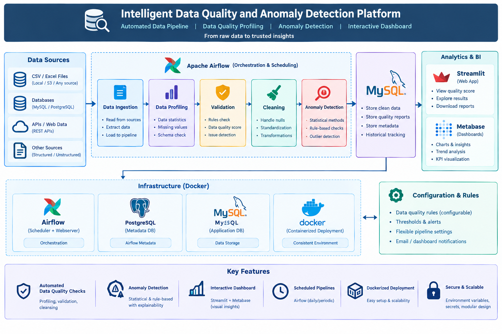

# Intelligent Data Quality & Anomaly Detection Platform

An end-to-end data quality and anomaly detection platform that automatically profiles structured datasets, validates data quality, cleans and quarantines invalid records, detects unusual patterns using machine learning, stores results in MySQL, and provides monitoring through Airflow, Streamlit, and Metabase.

## Overview

Real-world data frequently contains missing values, duplicate records, invalid formats, inconsistent values, incorrect numeric ranges, and unusual records.

This platform automates the data quality workflow so that raw datasets can be transformed into cleaner, validated, analysis-ready data while also identifying potentially anomalous records.

The system is designed to be **configurable, modular, and domain-independent**, while the included sample dataset demonstrates the workflow using e-commerce order data.

## Key Features

* Automated CSV data ingestion
* Automated dataset profiling
* Configurable data validation rules using YAML
* Missing-value and schema validation
* Duplicate detection
* Numeric range validation
* Allowed-value validation
* Email and date format validation
* Automated data cleaning
* Invalid-record quarantine
* Duplicate removal
* Data quality scoring
* Machine-learning-based anomaly detection using Isolation Forest
* Feature-level anomaly unusualness using robust MAD statistics
* Human-readable anomaly explanations
* MySQL storage
* Pipeline execution tracking
* Airflow pipeline orchestration
* Streamlit interactive application
* Metabase analytics dashboard
* Automated unit tests using Pytest
* Docker containerization
* Docker health checks
* Non-root application container
* Git/GitHub version control

## Architecture



## End-to-End Workflow

```text
Data Source
    ↓
Airflow Orchestration
    ↓
Data Ingestion
    ↓
Data Profiling
    ↓
Data Validation
    ↓
Data Cleaning & Quarantine
    ↓
ML Anomaly Detection
    ↓
MySQL Database
    ↓
┌─────────────────┬─────────────────┐
│                 │                 │
Streamlit       Metabase        Pipeline Metrics
Application     Dashboard        & Monitoring
```

## Data Quality Validation

Validation rules are defined externally in:

```text
config/validation_rules.yaml
```

This keeps business rules separate from the Python implementation.

The validation engine currently supports:

* Required columns
* Duplicate checks
* Minimum and maximum numeric values
* Allowed categorical values
* Email format validation
* Date format validation
* Schema validation
* Overall data quality scoring

Example:

```yaml
rules:
  customer_age:
    required: true
    min: 18
    max: 100

  quantity:
    required: true
    min: 1

  payment_method:
    required: true
    allowed_values:
      - Credit Card
      - Debit Card
      - UPI
      - Cash
      - Net Banking
```

## Data Cleaning & Quarantine

Records containing invalid data are separated from the clean dataset instead of being silently discarded.

The cleaning stage handles:

* Negative numeric values
* Invalid email addresses
* Invalid dates
* Duplicate records
* Invalid records requiring quarantine

Outputs include:

```text
data/processed/cleaned_data.csv
data/quarantine/quarantined_data.csv
```

## Anomaly Detection

The platform uses **Isolation Forest** to identify unusual records in numerical features.

The anomaly detection workflow:

```text
Clean Data
    ↓
Feature Selection
    ↓
Missing Value Handling
    ↓
Isolation Forest
    ↓
Anomaly Prediction
    ↓
Anomaly Score
    ↓
Feature-Level Unusualness
    ↓
Human-Readable Explanation
```

Feature-level unusualness is calculated using a robust **Median Absolute Deviation (MAD)** based approach.

For example:

```text
quantity = 85 is unusually high
median quantity = 3
```

This makes anomaly results easier to interpret rather than providing only a binary anomaly label.

## Pipeline Monitoring

Each Airflow pipeline execution is tracked in MySQL.

The system records:

* Pipeline run ID
* Start time
* End time
* Execution status
* Original row count
* Cleaned row count
* Quarantined row count
* Duplicate count
* Anomaly count
* Data quality score
* Error information

This provides historical visibility into pipeline executions.

## Dashboards

### Streamlit

The Streamlit application provides:

* Dataset upload
* Dataset preview
* Row and column statistics
* Data quality score
* Validation results
* Cleaning results
* Quarantined records
* Anomaly results
* Anomaly explanations
* Data visualizations
* Downloadable processed data

### Metabase

The BI dashboard provides analytical views such as:

* Total clean records
* Anomalous records
* Data quality score
* Data retention rate
* Quarantined records
* Duplicates removed
* Sales by category
* Orders by category
* Monthly sales trend
* Average order value
* Orders by payment method
* Anomaly distribution

## Airflow Pipeline

The automated pipeline consists of the following major tasks:

```text
Start Pipeline
      ↓
Ingestion
      ↓
Profiling
      ↓
Validation
      ↓
Cleaning
      ↓
Anomaly Detection
      ↓
Database Load
      ↓
Pipeline Metrics
      ↓
Finish Pipeline
```

Airflow also tracks failed tasks and records pipeline failures in the database.

## Testing

Automated tests are implemented using **Pytest**.

Current test coverage includes:

* Validation of valid datasets
* Invalid allowed-value detection
* Negative-value quarantine
* Duplicate removal
* Feature selection
* Anomaly prediction and scoring

Run the test suite with:

```bash
pytest
```

## Technology Stack

| Category               | Technology             |
| ---------------------- | ---------------------- |
| Programming            | Python                 |
| Data Processing        | Pandas, NumPy          |
| Machine Learning       | Scikit-learn           |
| Database               | MySQL                  |
| ORM / Connection       | SQLAlchemy, PyMySQL    |
| Workflow Orchestration | Apache Airflow         |
| Application            | Streamlit              |
| BI & Visualization     | Metabase, Power BI     |
| Configuration          | YAML                   |
| Testing                | Pytest                 |
| Containerization       | Docker, Docker Compose |
| Version Control        | Git, GitHub            |

## Project Structure

```text
Intelligent-Data-Quality/
│
├── app/
│   └── app.py
│
├── config/
│   └── validation_rules.yaml
│
├── dags/
│   └── data_quality_pipeline.py
│
├── data/
│   ├── raw/
│   ├── processed/
│   └── quarantine/
│
├── docs/
│   └── architecture.png
│
├── src/
│   ├── ingestion/
│   ├── profiling/
│   ├── validation/
│   ├── cleaning/
│   ├── anomaly_detection/
│   └── database/
│
├── tests/
│   ├── test_validator.py
│   ├── test_cleaner.py
│   └── test_anomaly_detector.py
│
├── Dockerfile
├── docker-compose.yml
├── pytest.ini
├── requirements.txt
├── .dockerignore
├── .gitignore
└── README.md
```

## Running Locally

### Python environment

Create and activate a virtual environment:

```bash
python -m venv venv
```

Windows:

```powershell
venv\Scripts\activate
```

Install dependencies:

```bash
pip install -r requirements.txt
```

### Streamlit

Run the application:

```bash
streamlit run app/app.py
```

The application will be available at:

```text
http://localhost:8501
```

### Docker

Build and start the services:

```bash
docker compose up -d --build
```

Check service health:

```bash
docker compose ps
```

The main services are:

```text
Streamlit → http://localhost:8501
Airflow   → http://localhost:8080
```

PostgreSQL is used as the Airflow metadata database.

## Example Pipeline Results

Using the included sample dataset, a typical pipeline execution processes records through:

```text
Raw Records
    ↓
Validation
    ↓
Cleaning
    ↓
Quarantine
    ↓
Anomaly Detection
    ↓
Database Storage
    ↓
Dashboard
```

The pipeline records both **data quality results** and **pipeline execution status**, allowing data problems to be distinguished from infrastructure or execution failures.

## Security & Deployment Practices

The Docker setup includes several production-oriented practices:

* Application runs as a non-root Docker user
* PostgreSQL health checks
* Airflow health checks
* Streamlit health checks
* Service dependency conditions
* Environment variables for database configuration
* `.env` excluded from Git
* Sensitive Airflow password files excluded from Git
* Docker build context minimized with `.dockerignore`

## Future Improvements

Potential future enhancements include:

* Support for additional file formats
* More configurable validation rule types
* Additional anomaly detection algorithms
* Automatic alerting
* Cloud deployment
* Data quality trend monitoring
* Role-based access control
* More extensive automated test coverage
* CI/CD integration

## Author

**Shubham Chavan**

GitHub: https://github.com/Shubham479927
